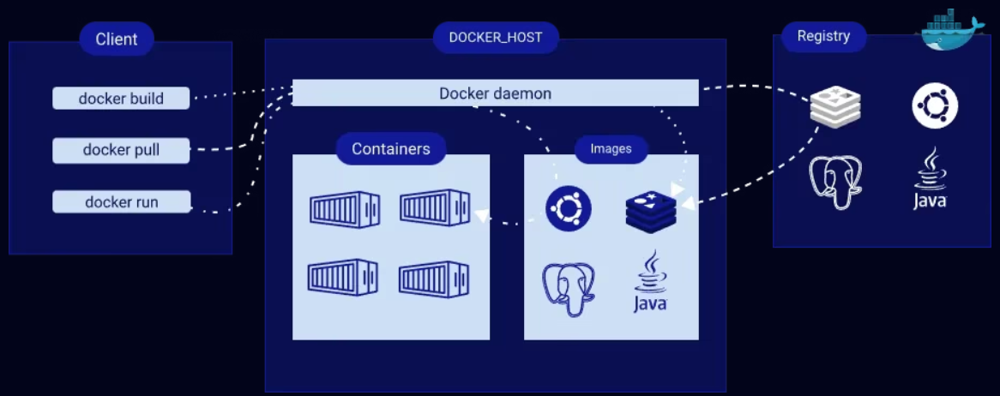
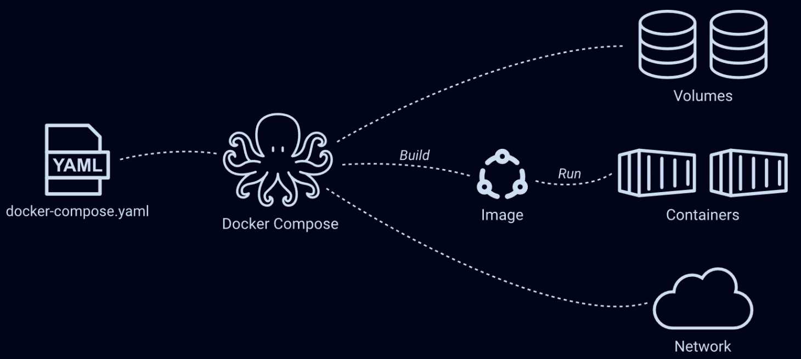
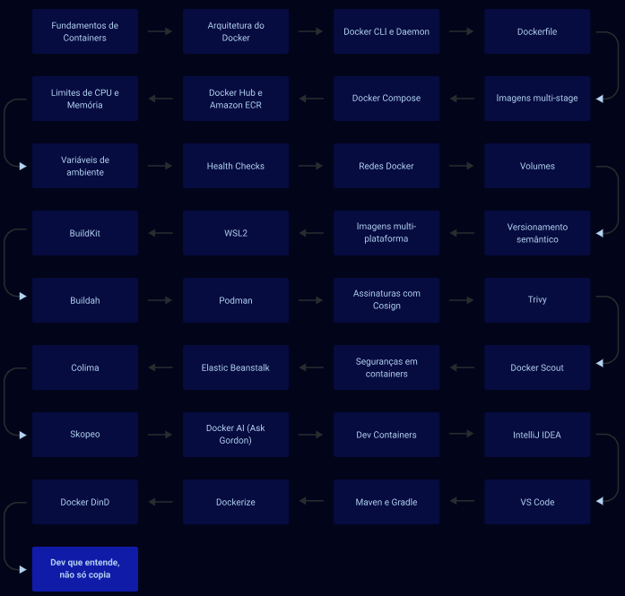

# 🐳 Imersão Docker: Containers na Prática

Este repositório contém as soluções dos desafios e projetos práticos desenvolvidos durante a **Imersão Docker** da plataforma **AlgaWorks**.

O objetivo deste espaço é registrar minha evolução e consolidação de conhecimentos em conteinerização, infraestrutura de aplicações, orquestração de múltiplos serviços, segurança e ferramentas modernas do ecossistema de containers.







---

## 🛠️ Tecnologias e Ferramentas

- **Orquestração e Containers:** Docker, Docker Compose
- **Desenvolvimento:** Docker Desktop, Dev Containers (VS Code / IntelliJ)
- **Segurança e Análise:** Docker Scout, Trivy, Cosign
- **Alternativas Modernas:** Podman, Buildah, Skopeo
- **Linguagens de Suporte:** Java (Spring Boot) / Angular (nos desafios práticos)
- **Controle de Versão:** Git & GitHub
- **Documentação:** Markdown

<!-- Badges / Ícones de Tecnologias -->
<p>
  
  
  
  
  
  
  
</p>

---

## 📁 Estrutura de Conteúdos

Os desafios e estudos estão consolidados e organizados em pastas numeradas por tópicos/módulos. Cada diretório contém sua respectiva aplicação ou laboratório prático.

|  Cap.  | Pasta / Módulo                | Conteúdo Principal                                                                                        |     Status      |
| :----: | :---------------------------- | :-------------------------------------------------------------------------------------------------------- | :-------------: |
| **02** | `02-mergulhando-containers`   | Comandos básicos, ciclo de vida, variáveis de ambiente e **Desafio: App Java**[cite: 1]                   | ⏳ Em andamento |
| **03** | `03-criando-imagens`          | Dockerfiles, argumentos de build, **multi-stage build**, Nginx e **Desafio: multi-stage build**[cite: 2]  |  📅 Planejado   |
| **04** | `04-explorando-volumes`       | Volumes nomeados, anônimos, Bind Mounts e **Desafio: Transferindo dados entre volumes**[cite: 3]          |  📅 Planejado   |
| **06** | `06-docker-compose`           | Múltiplos containers, variáveis de ambiente, Health Checks e **Desafio: Docker Compose**[cite: 4]         |  📅 Planejado   |
| **09** | `09-ambiente-desenvolvimento` | Debug remoto, extensão Container Tools e **Desafio: Criação de um Dev Container**[cite: 5]                |  📅 Planejado   |
| **10** | `10-segurança-container`      | Análise de vulnerabilidades (Docker Scout/Trivy) e **Desafio: Correção e Assinatura com Cosign**[cite: 6] |  📅 Planejado   |
| **11** | `11-alem-do-docker`           | Podman, Buildah, Skopeo (Rootless) e **Desafio: Java com Podman rootless**[cite: 7]                       |  📅 Planejado   |

---

## 🚀 Como Executar os Projetos

1. Clone este repositório:
   ```bash
   git clone [https://github.com/ivanfsilva/idk-imersao-docker.git](https://github.com/ivanfsilva/idk-imersao-docker.git)
   ```
2. Navegue até a pasta do módulo/desafio desejado.

3. Siga as instruções específicas de execução (via Dockerfile ou docker-compose up) descritas no README interno de cada pasta.

---

## 👤 Autor

Desenvolvido por Ivan Ferreira.

Copyright © 2026 Ivan Ferreira. Todos os direitos reservados.
